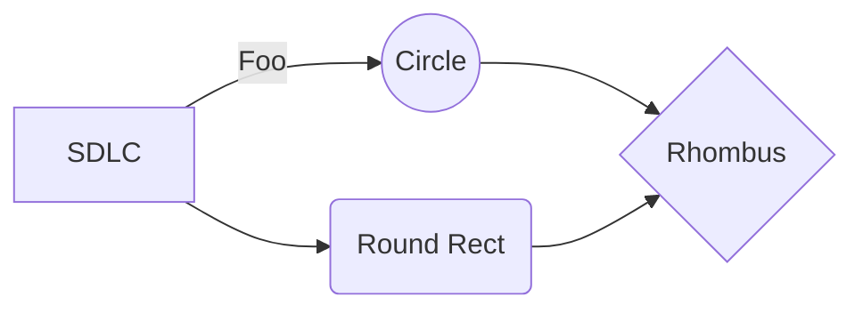

# x86 Assembly Projects

This repo is intellectual property of James Andrew Cato, /u/catoja1107. Unauthorized access, reproduction, use, copying or modification of this material is restricted unless given explicit *hand-written* permission. **StackEdit**

# Project List

## Lab 8

This project blah

## Lab 9(a)

All your files and folders are presented as a tree in the file explorer. You can switch from one to another by clicking a file in the tree.

## Lab 9(b)

You can rename the current file by clicking the file name in the navigation bar or by clicking the **Rename** button in the file explorer.

## Lab 9(c)

You can delete the current file by clicking the **Remove** button in the file explorer. The file will be moved into the **Trash** folder and automatically deleted after 7 days of inactivity.

## Lab 9(d)

You can export the current file by clicking **Export to disk** in the menu. You can choose to export the file as plain Markdown, as HTML using a Handlebars template or as a PDF.

## Lab 10

You can export the current file by clicking **Export to disk** in the menu. You can choose to export the file as plain Markdown, as HTML using a Handlebars template or as a PDF.

## Lab 11

You can export the current file by clicking **Export to disk** in the menu. You can choose to export the file as plain Markdown, as HTML using a Handlebars template or as a PDF.

## Assign31

You can export the current file by clicking **Export to disk** in the menu. You can choose to export the file as plain Markdown, as HTML using a Handlebars template or as a PDF.

## Assign32

You can export the current file by clicking **Export to disk** in the menu. You can choose to export the file as plain Markdown, as HTML using a Handlebars template or as a PDF.

## Assign33

You can export the current file by clicking **Export to disk** in the menu. You can choose to export the file as plain Markdown, as HTML using a Handlebars template or as a PDF.

# Publication

Publishing in StackEdit makes it simple for you to publish online your files. Once you're happy with a file, you can publish it to different hosting platforms like **Blogger**, **Dropbox**, **Gist**, **GitHub**, **Google Drive**, **WordPress** and **Zendesk**. With [Handlebars templates](http://handlebarsjs.com/), you have full control over what you export.

> Before starting to publish, you must link an account in the **Publish** sub-menu.

## Publish a File

You can publish your file by opening the **Publish** sub-menu and by clicking **Publish to**. For some locations, you can choose between the following formats:

- Markdown: publish the Markdown text on a website that can interpret it (**GitHub** for instance),
- HTML: publish the file converted to HTML via a Handlebars template (on a blog for example).

## UML diagrams

UML diagram framework provided by [Mermaid](https://mermaidjs.github.io/).

And this will produce a flow chart:

